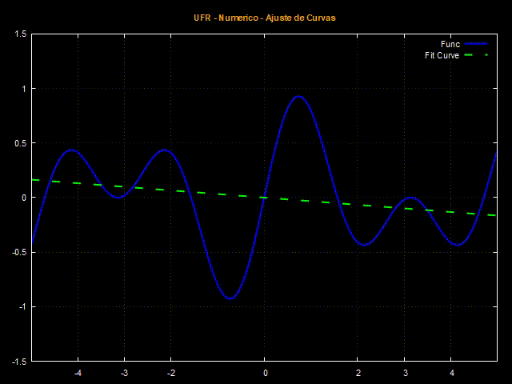

# Ajuste de Curvas  
Abaixo mostramos o resultado do ajuste da curva $f(x)=sin(2x)cos(x/2)$ no intervalor $x\in [-5, 5]$. A sequência foi criada utilizando-se os graus $n=3,5,7,9,11,13 \text{ e } 15$

  

Neste trabalho escolhemos a **base canônica={**$1,x,x^2,\dots,x^n$**}** do espaço dos $\mathbb{P}_n(x)$. 

Deste modo teremos $$f(x)\approx a_0+a_1x+a_2x^2+\dots+a_nx^n$$

O valor de cada coeficiente é dado pelo sistema

Lembrando que como estamos ajustando a função $f(x)$ no intervalo $x \in [-5,5]$ temos que o produto interno será dado pela fórmula 

